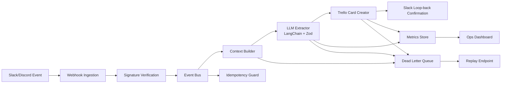

# ContextFlow

AI-Powered Event-Driven Workflow for Business Communication.

ContextFlow monitors Slack/Discord events, synthesizes messy conversations into structured work using LLMs, creates Trello tickets automatically, and posts confirmation back into the source thread.

## Why This Project Stands Out

- Solves a real remote-team problem: context loss in async collaboration.
- Demonstrates senior-level backend design: event-driven pipeline, idempotency, dead-letter queue, replay, and observability.
- Uses modern AI engineering patterns: structured output, schema validation, deterministic fallback, multi-provider support.
- Includes a full-stack operations dashboard for reliability monitoring and live demos.

## Architecture



## Core Features

- Real-time ingestion from Slack and Discord webhook events.
- Trigger modes:
  - Emoji reaction trigger in Slack (`white_check_mark` by default).
  - Inline command trigger via `#task`, `/todo`, or `[task]`.
- Context synthesis from thread history plus triggering message.
- AI extraction with LangChain:
  - 2-sentence summary
  - assignee
  - deadline in ISO format
  - priority (`low`, `medium`, `high`, `critical`)
  - action items and confidence
- Structured validation with Zod.
- Trello card creation with due date and priority labels.
- Slack thread loop-back with generated card URL.

## Extraordinary Features Added

- In-memory idempotency protection to skip duplicate webhook events.
- Dead-letter queue persisted as JSONL (`data/dead-letter.jsonl`).
- Replay endpoint for failed events.
- Ops API (`/api/metrics`, `/api/dead-letters`, `/api/replay/:eventId`).
- Full-stack operations dashboard at `/` with success rate, latency, and replay controls.
- AI provider fallback strategy:
  - OpenAI (`gpt-4o-mini`) or Gemini (`gemini-1.5-pro`) via LangChain.
  - Deterministic parser fallback for local demos and resilient behavior.
- CI pipeline with typecheck, build, and tests.
- Dockerized runtime for consistent deployment.

## Tech Stack

- Runtime: Node.js, Express, TypeScript
- AI Orchestration: LangChain, OpenAI, Google Gemini
- Validation: Zod
- Integrations: Slack Web API, Trello REST API
- Reliability: dead-letter queue, idempotency store, replay API, metrics
- Testing: Vitest, Supertest
- Deployment: Docker, GitHub Actions CI

## Local Setup

1. Clone and install:

```bash
git clone <your-repo-url>
cd ContextFlow
npm install
```

2. Configure environment variables:

```bash
cp .env.example .env
```

3. Run in development mode:

```bash
npm run dev
```

4. Build and run production mode:

```bash
npm run build
npm start
```

## Required Credentials

- Slack app with scopes: `channels:history`, `chat:write`.
- Trello key/token and target list ID.
- At least one AI key:
  - `OPENAI_API_KEY`, or
  - `GOOGLE_API_KEY`.

For local demo without AI keys, keep `MOCK_AI=true` in `.env`.

## Webhook Endpoints

- Slack events: `POST /webhooks/slack/events`
- Discord events: `POST /webhooks/discord/events`

Use ngrok for local webhook testing:

```bash
ngrok http 3000
```

Then set Slack Request URL to:

```text
https://<ngrok-id>.ngrok-free.app/webhooks/slack/events
```

## Operations Endpoints

- Health: `GET /api/healthz`
- Readiness: `GET /api/readyz`
- Metrics: `GET /api/metrics`
- Dead letters: `GET /api/dead-letters`
- Replay failed event: `POST /api/replay/:eventId`

## Test and Quality Commands

```bash
npm run typecheck
npm run test
npm run build
```

## Docker

```bash
docker build -t contextflow .
docker run --env-file .env -p 3000:3000 contextflow
```

## Suggested Resume / Portfolio Positioning

Use this as a “Workflow Intelligence Platform” project and highlight:

- Event-driven architecture for real-time collaboration systems.
- LLM-to-business workflow automation with schema-safe outputs.
- Reliability engineering (DLQ, replay, idempotency, metrics).
- API integration depth (Slack + Trello + AI providers).
- Full-stack ownership with backend services plus ops UI.

## Future Extensions

- Jira integration (parallel output with Trello).
- Persistent event store with Redis/Postgres.
- Queue-backed execution (BullMQ/SQS) for horizontal scaling.
- Per-workspace AI prompt templates and confidence thresholds.
- Role-based access for replay/ops controls.
