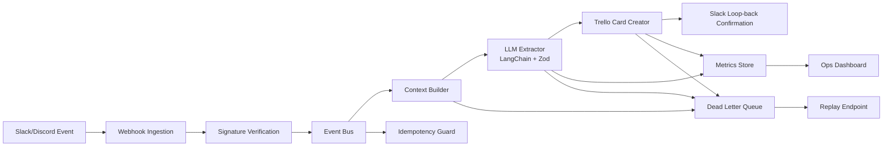

# ContextFlow

AI-Powered Event-Driven Workflow for Business Communication.

ContextFlow monitors Slack/Discord events, synthesizes messy conversations into structured work using LLMs, creates Trello or Jira tickets automatically, and posts confirmation back into the source thread.

## Documentation Index

- [docs/TECH_STACK_DEEP_DIVE.md](docs/TECH_STACK_DEEP_DIVE.md): Deep explanation of each technology choice, trade-offs, and implementation details.
- [docs/SYSTEM_ARCHITECTURE.md](docs/SYSTEM_ARCHITECTURE.md): Component architecture and end-to-end runtime topology.
- [docs/SYSTEM_DESIGN.md](docs/SYSTEM_DESIGN.md): Functional and non-functional system design decisions.
- [docs/WORKFLOW_LIFECYCLE.md](docs/WORKFLOW_LIFECYCLE.md): Step-by-step workflow execution and lifecycle transitions.
- [docs/UI_UX_SYSTEM.md](docs/UI_UX_SYSTEM.md): Visual design language, interaction model, motion system, and accessibility notes.
- [docs/demo-requests.md](docs/demo-requests.md): Sample simulation requests for demos.

## How The System Works

1. A trigger event is received from Slack, Discord, or simulation endpoint.
2. Signature verification guards the webhook trust boundary.
3. Payload is normalized into a typed TriggerEvent contract.
4. Event bus emits ingestion lifecycle and queue driver schedules execution.
5. Workflow service builds context and extracts structured task intent with AI.
6. Workspace policy validates confidence threshold and provider routing.
7. Provider adapter creates Trello/Jira issue, then workflow publishes success/failure lifecycle events.
8. Metrics, run history, dead-letter records, and SSE stream update the dashboard in realtime.

Deep execution details are documented in [docs/WORKFLOW_LIFECYCLE.md](docs/WORKFLOW_LIFECYCLE.md).

## Hiring Manager Snapshot

ContextFlow demonstrates deep, practical engineering across backend systems, AI orchestration, reliability engineering, integration development, and operations UX.

- Backend architecture: event-driven processing, queue abstraction, idempotency, dead-lettering, replay.
- AI engineering: provider-agnostic extraction, schema validation, confidence gating, deterministic fallback.
- Integration engineering: Slack, Trello, Jira adapters with normalized contracts.
- Production operations: observability APIs, realtime stream, run history intelligence, RBAC.
- Full-stack execution: simulation-first command center with replay and live status telemetry.

## Tech Stack Mastery Map

| Layer | Technologies | What It Demonstrates |
|---|---|---|
| Runtime and API | Node.js, Express 5, TypeScript | Async event ingestion, typed contracts, middleware-driven architecture |
| AI Orchestration | LangChain, OpenAI, Gemini, Zod | Structured extraction with validation and provider portability |
| Integrations | Slack API, Trello API, Jira API | Multi-system interoperability with adapter-based routing |
| Reliability | Event bus, idempotency store, dead-letter queue, replay API | Fault isolation, retry workflows, duplicate protection |
| Queueing | Inline worker, BullMQ, Redis option | Local simplicity plus production scaling path |
| Observability | Metrics API, run journal, SSE stream, live dashboard | Operational visibility and real-time diagnostics |
| Security | Signature verification, ops RBAC keys | Trust boundary validation and controlled admin actions |
| Delivery | Docker, GitHub Actions, Vercel-compatible demo mode | CI quality gates and cloud deployment readiness |

For detailed implementation depth, read [docs/TECH_STACK_DEEP_DIVE.md](docs/TECH_STACK_DEEP_DIVE.md).

## What This Is In Real Life

ContextFlow is a workflow assistant for teams that lose important tasks inside chat.

- A product manager drops a bug report in Slack and nobody creates the ticket.
- A client request gets buried in a long async thread.
- A handoff message includes action items, deadlines, and owners, but it never reaches the tracker.
- A support or operations channel contains urgent work, but triage is inconsistent.

This project turns those noisy conversations into structured tasks automatically, so work moves from chat into execution.

## Why I Built This

I built ContextFlow to solve a common problem in remote teams: communication happens in chat, but execution happens in tools like Trello or Jira. That gap causes missed tasks, slow handoffs, and manual copy-paste work.

The goal of this project is to show how AI can be used in a practical, production-oriented way:

- convert unstructured messages into structured work
- reduce manual project coordination
- improve traceability from conversation to ticket
- add reliability controls so automation is observable and safe

## Why This Project Stands Out

- Solves a real remote-team problem: context loss in async collaboration.
- Demonstrates senior-level backend design: event-driven pipeline, idempotency, dead-letter queue, replay, and observability.
- Uses modern AI engineering patterns: structured output, schema validation, deterministic fallback, multi-provider support.
- Includes a full-stack operations dashboard for reliability monitoring and live demos.

## Architecture



## Core Features

- Real-time ingestion from Slack and Discord webhook events.
- Trigger modes:
  - Emoji reaction trigger in Slack (`white_check_mark` by default).
  - Inline command trigger via `#task`, `/todo`, or `[task]`.
- Context synthesis from thread history plus triggering message.
- AI extraction with LangChain:
  - 2-sentence summary
  - assignee
  - deadline in ISO format
  - priority (`low`, `medium`, `high`, `critical`)
  - action items and confidence
- Structured validation with Zod.
- Trello card creation with due date and priority labels.
- Slack thread loop-back with generated card URL.

## Extraordinary Features Added

- In-memory idempotency protection to skip duplicate webhook events.
- Dead-letter queue persisted as JSONL (`data/dead-letter.jsonl`).
- Replay endpoint for failed events.
- Ops API (`/api/metrics`, `/api/dead-letters`, `/api/replay/:eventId`).
- Full-stack live command center at `/` with simulation lab, status intelligence, and replay controls.
- Realtime workflow stream with Server-Sent Events (`/api/stream`).
- Recent run intelligence endpoint (`/api/runs`) for operational visibility.
- Synthetic event simulator endpoint (`/api/simulate`) for demos and stress scenarios.
- Multi-provider ticketing abstraction with runtime routing (`trello` or `jira`).
- Queue-backed execution modes: inline worker or BullMQ + Redis for retries and throughput.
- Workspace policy engine with per-workspace prompt prefixes and confidence thresholds.
- Persistent run journal (`data/workflow-runs.jsonl`) for operational history.
- Ops RBAC support with viewer/admin API keys for production-safe control endpoints.
- AI provider fallback strategy:
  - OpenAI (`gpt-4o-mini`) or Gemini (`gemini-1.5-pro`) via LangChain.
  - Deterministic parser fallback for local demos and resilient behavior.
- CI pipeline with typecheck, build, and tests.
- Dockerized runtime for consistent deployment.

## Real-World Use Cases

- Engineering teams: convert bug reports, outage notes, and release blockers from Slack into trackable tickets.
- Startup teams: turn founder or client messages into tasks without needing a dedicated project coordinator.
- Agencies: capture client change requests from chat and route them into a shared delivery board.
- Operations teams: transform incident updates into follow-up actions with owners and deadlines.
- Student or university teams: use chat as the input surface and still keep project work organized.

## Demo Mode

You can run this project without Slack, Trello, Jira, or paid AI accounts.

- `MOCK_AI=true` keeps extraction local and predictable for demos.
- `MOCK_ISSUE=true` creates mock ticket URLs so the full workflow still succeeds.
- `/api/simulate` and the dashboard let you test realistic scenarios end-to-end.

This makes the project easy to show on GitHub, in interviews, or in a portfolio without external setup.

## What To Put In .env

For most local usage, you only need demo settings.

Minimum local setup that always runs:

```env
PORT=3000
NODE_ENV=development
BASE_URL=http://localhost:3000
MOCK_AI=true
MOCK_ISSUE=true
ISSUE_PROVIDER=trello
QUEUE_DRIVER=inline
```

With this setup:

- no Slack app is required
- no Trello account is required
- no Jira account is required
- no OpenAI or Gemini key is required
- the dashboard and simulation flow still work end-to-end

Only add real API keys when you want live integrations.

## Where To Find API Keys

- Slack:
  create an app at https://api.slack.com/apps
  get `SLACK_SIGNING_SECRET` from `Basic Information`
  get `SLACK_BOT_TOKEN` from `OAuth & Permissions`
- OpenAI:
  create `OPENAI_API_KEY` at https://platform.openai.com/api-keys
- Gemini:
  create `GOOGLE_API_KEY` at https://aistudio.google.com/app/apikey
- Trello:
  get `TRELLO_API_KEY` and `TRELLO_TOKEN` at https://trello.com/app-key
- Jira:
  create `JIRA_API_TOKEN` at https://id.atlassian.com/manage-profile/security/api-tokens
  `JIRA_BASE_URL` looks like `https://your-company.atlassian.net`

## Which Variables Are Actually Required

- For demo mode:
  none beyond the basic local settings above
- For real AI extraction:
  `MOCK_AI=false` plus either `OPENAI_API_KEY` or `GOOGLE_API_KEY`
- For real Trello tickets:
  `MOCK_ISSUE=false`, `ISSUE_PROVIDER=trello`, `TRELLO_API_KEY`, `TRELLO_TOKEN`, `TRELLO_LIST_ID`
- For real Jira tickets:
  `MOCK_ISSUE=false`, `ISSUE_PROVIDER=jira`, `JIRA_BASE_URL`, `JIRA_USER_EMAIL`, `JIRA_API_TOKEN`, `JIRA_PROJECT_KEY`
- For real Slack ingestion:
  `SLACK_SIGNING_SECRET` and `SLACK_BOT_TOKEN`

## How To Keep It Running Locally

Use demo mode for reliable local usage:

- keep `MOCK_AI=true`
- keep `MOCK_ISSUE=true`
- keep `QUEUE_DRIVER=inline`
- start with `npm run dev`

If you close the terminal, start it again with `npm run dev`. For a real always-on deployment, run the built app on a host like Render, Railway, or Fly.io.

## Tech Stack

- Runtime: Node.js, Express, TypeScript
- AI Orchestration: LangChain, OpenAI, Google Gemini
- Validation: Zod
- Integrations: Slack Web API, Trello REST API
- Reliability: dead-letter queue, idempotency store, replay API, metrics
- Testing: Vitest, Supertest
- Deployment: Docker, GitHub Actions CI

## Local Setup

1. Clone and install:

```bash
git clone <your-repo-url>
cd ContextFlow
npm install
```

2. Configure environment variables:

```bash
cp .env.example .env
```

3. Run in development mode:

```bash
npm run dev
```

4. Build and run production mode:

```bash
npm run build
npm start
```

## Required Credentials

- Slack app with scopes: `channels:history`, `chat:write`.
- Trello key/token and target list ID.
- At least one AI key:
  - `OPENAI_API_KEY`, or
  - `GOOGLE_API_KEY`.

For local demo without external accounts, keep `MOCK_AI=true` and `MOCK_ISSUE=true` in `.env`.

## Webhook Endpoints

- Slack events: `POST /webhooks/slack/events`
- Discord events: `POST /webhooks/discord/events`

Use ngrok for local webhook testing:

```bash
ngrok http 3000
```

Then set Slack Request URL to:

```text
https://<ngrok-id>.ngrok-free.app/webhooks/slack/events
```

## Operations Endpoints

- Health: `GET /api/healthz`
- Readiness: `GET /api/readyz`
- Metrics: `GET /api/metrics`
- Runs: `GET /api/runs?limit=20`
- Live stream: `GET /api/stream`
- Dead letters: `GET /api/dead-letters`
- Replay failed event: `POST /api/replay/:eventId`
- Trigger simulated event: `POST /api/simulate`

If ops keys are configured, send one of these:

- Header: `x-api-key: <OPS_VIEWER_API_KEY or OPS_ADMIN_API_KEY>`
- For SSE stream in browser: `GET /api/stream?api_key=<key>`

## Test and Quality Commands

```bash
npm run typecheck
npm run test
npm run build
```

## Docker

```bash
docker build -t contextflow .
docker run --env-file .env -p 3000:3000 contextflow
```

## Suggested Resume / Portfolio Positioning

Use this as a “Workflow Intelligence Platform” project and highlight:

- Event-driven architecture for real-time collaboration systems.
- LLM-to-business workflow automation with schema-safe outputs.
- Reliability engineering (DLQ, replay, idempotency, metrics).
- API integration depth (Slack + Trello/Jira + AI providers).
- Full-stack ownership with backend services plus ops UI.

Interview-ready impact statements:

- Designed a provider-agnostic ticketing adapter to support Trello and Jira without changing workflow logic.
- Built policy-aware AI extraction with workspace-level confidence thresholds to reduce low-quality automation.
- Introduced queue-backed processing with retry semantics and persistent operational journaling.

## How To Explain This On GitHub

Short version:

`ContextFlow is an AI workflow automation platform that turns chat conversations into structured project tasks.`

Longer version:

`I built ContextFlow to solve a real workflow problem: teams discuss work in Slack or Discord, but execution still depends on someone manually creating and tracking tasks. This project uses AI to extract structured intent from chat, route it into a ticketing system, and provide operational visibility through replay, queues, journaling, and a live dashboard.`

## Future Extensions

- [x] Jira integration (runtime-selectable provider abstraction).
- [x] Queue-backed execution with BullMQ option.
- [x] Per-workspace prompt templates and confidence thresholds.
- [x] Role-based access for replay/ops controls.
- [ ] Full persistent event store with Postgres read models.
- [ ] Multi-region async execution with SQS/Kafka transport.
- [ ] Human-in-the-loop approval workflow before ticket creation.
