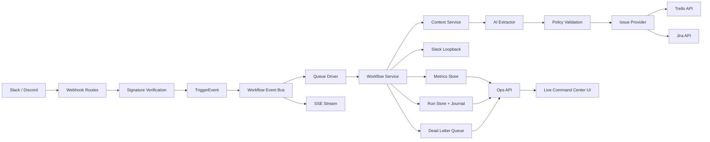
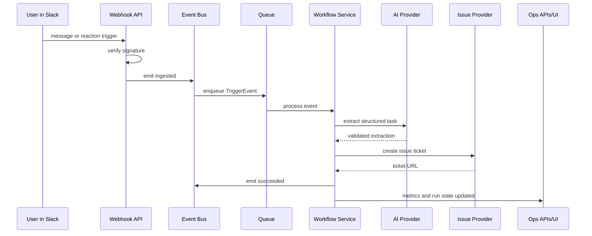

# ContextFlow System Architecture

This document describes the architecture at component and data-flow level for both interview discussions and production planning.

## 1. High-Level View

## 2. Architectural Principles

- Event-driven orchestration
  - Ingestion is decoupled from execution using event bus semantics.
- Explicit reliability controls
  - Idempotency, dead-letter isolation, replay, and metrics are first-class.
- Provider abstraction
  - Ticket destination is selected through adapter pattern, not hardcoded in business logic.
- Policy-aware automation
  - Workspace-specific prompts, confidence thresholds, and provider routing.
- Observable by default
  - Operators can monitor state transitions and replay failures without code changes.

## 3. Core Components

### Webhook Ingestion Layer
- Accepts Slack and Discord webhook events.
- Verifies request authenticity before processing.
- Converts external payloads into normalized TriggerEvent objects.

### Event Bus Layer
- Publishes lifecycle events:
  - ingested
  - processing
  - succeeded
  - failed
  - duplicate
- Drives queueing and realtime stream fan-out.

### Queue Layer
- Inline mode:
  - Local dev and lightweight demo workflows.
- BullMQ mode:
  - Redis-backed retries, concurrency, and async scaling.

### Workflow Service Layer
- Pipeline responsibilities:
  - context collection
  - AI extraction
  - confidence threshold enforcement
  - issue creation through provider abstraction
  - Slack loopback response
  - metrics + run state updates
  - dead-lettering on failure

### Integration Layer
- AI providers:
  - OpenAI, Gemini, deterministic fallback
- Issue providers:
  - Trello, Jira
- Chat integration:
  - Slack context fetch and thread replies

### Operations Layer
- Metrics API
- Run history API
- Dead-letter inspection API
- Replay API
- Server-Sent Events stream
- RBAC guard for operations endpoints

### Dashboard Layer
- Realtime command center for operators and interview demos.
- Includes:
  - simulation lab
  - activity feed
  - run table
  - dead-letter controls

## 4. Data Contracts

### TriggerEvent
Represents normalized inbound communication event regardless of source platform.

### ExtractedTask
Represents LLM-structured workflow intent:
- summary
- title
- assignee
- deadlineIso
- actionItems
- confidence
- priority

### WorkflowResult
Represents successful workflow completion metadata:
- eventId
- issueProvider
- ticketUrl
- latencyMs
- extracted task payload

### WorkflowFailureEvent
Represents failed execution metadata:
- eventId
- source
- reason
- createdAt

## 5. Lifecycle Sequence

## 6. Deployment Topology

### Local / Demo
- Single process
- Inline queue
- Optional mock AI + mock issue
- JSONL local persistence

### Production-Oriented
- Node API service
- Redis queue (BullMQ)
- External issue/chat providers
- Restricted ops endpoints via API keys
- External durable persistence recommended

## 7. Known Trade-Offs

- In-memory stores are fast and simple but not globally durable.
- JSONL persistence is good for local ops visibility but not ideal for multi-instance consistency.
- SSE works well for realtime dashboards; for very large fanout, WebSocket infra may be preferred.

## 8. Evolution Path

- Move run and dead-letter state to Postgres read models.
- Add event transport abstraction for Kafka/SQS.
- Add human approval state-machine before issue creation.
- Add distributed tracing and SLO dashboards.
